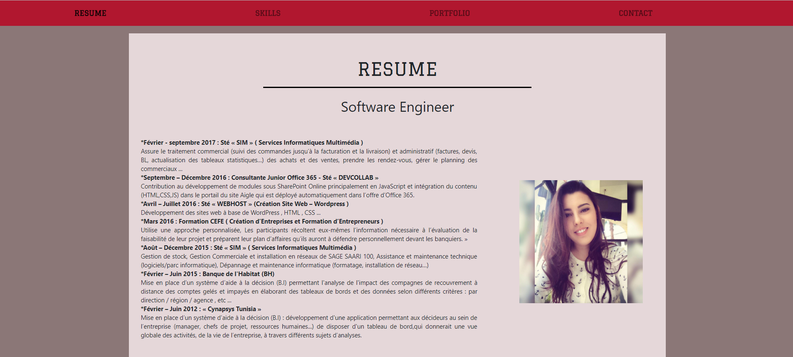

# Build My Portfolio Webpage

Build a portfolio :

	

## Project user stories

1. User story: I can access all of the portfolio webpage's content just by scrolling.

2. User story: I can see the screenshots of different projects that I have built. 

3. User story: I navigate to different sections of the webpage by clicking buttons in the navigation.

## What I used as technologies :

-  HTML + CSS + JQUERY + Bootstrap